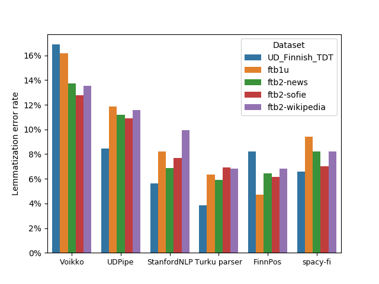
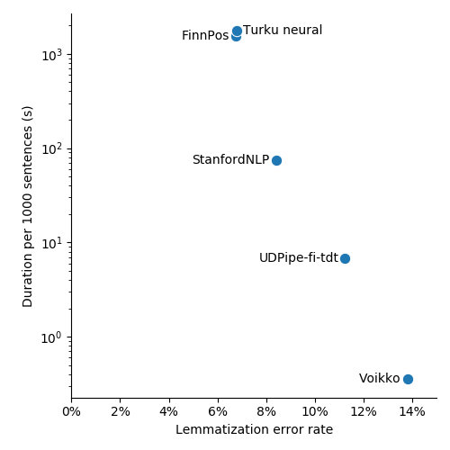
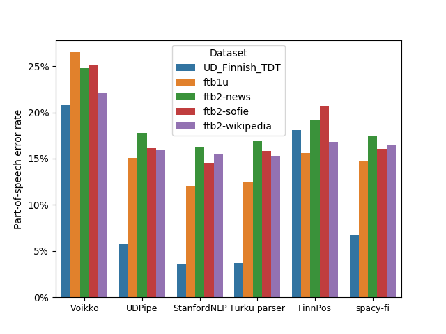
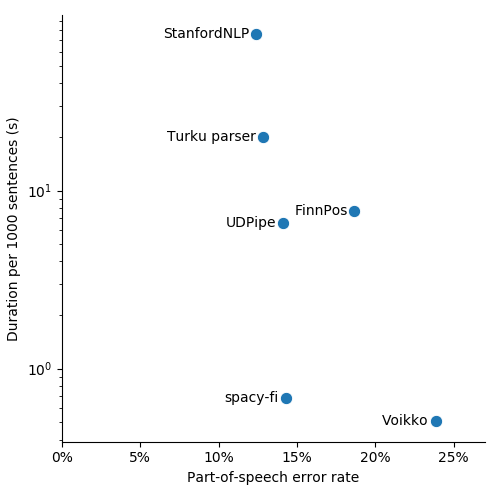

# Evaluating Finnish POS taggers and lemmatizers

This repository contains experiments comparing the accuracy of open
source Finnish part-of-speech taggers and lemmatization algorihtms.

### Tested algorithms

* [Experimental Finnish model for spaCy](https://github.com/aajanki/spacy-fi)
* [FinnPos](https://github.com/mpsilfve/FinnPos/wiki)
* [Simplemma](https://github.com/adbar/simplemma/)
* [Stanza](https://stanfordnlp.github.io/stanza/)
* [Trankit](https://trankit.readthedocs.io/en/latest/)
* [Turku neural parser pipeline](https://turkunlp.org/Turku-neural-parser-pipeline/)
* [UDPipe](http://ufal.mff.cuni.cz/udpipe) (through spacy-udpipe)
* [UralicNLP](https://github.com/mikahama/uralicNLP)
* [Voikko](https://voikko.puimula.org/)

### Test datasets

* [FinnTreeBank 1](https://github.com/UniversalDependencies/UD_Finnish-FTB/blob/master/README.md): randomly sampled subset of about 1000 sentences
* [FinnTreeBank 2](http://urn.fi/urn:nbn:fi:lb-201407163): news, Sofie and Wikipedia subsets
* [Turku Dependency Treebank](https://github.com/UniversalDependencies/UD_Finnish-TDT): the testset

## Setup

Install dependencies:
* Python 3.9
* libvoikko with Finnish morphology data files
* clang (or other C++ compiler)
* Dependencies needed to compile [FinnPos](https://github.com/mpsilfve/FinnPos) and [cg3](https://github.com/GrammarSoft/cg3)

Setup git submodules, create a Python virtual environment and download test data and models by running the following commands:
```
git submodule init
git submodule update

python3.9 -m venv venv
source venv/bin/activate
pip install wheel
pip install -r requirements.txt

./download_data.sh
./download_models.sh
python preprocess_data.py
```

## Run

```
export PATH=$(pwd)/models/cg3/src:$PATH
python evaluate.py

python plot_results.py
```

The numerical results will be saved in results/evaluation*.csv, POS and
lemma errors made by each model will be saved in results/errorcases,
and plots will be saved in results/images.

## Results

### Lemmatization



Lemmatization error rates (proportion of tokens where the predicted
lemma differs from the ground truth lemma) for the tested algorithms
on the test datasets.



Execution duration as a function of the average (over datasets) error
rate. Lower values are better on both axes. Notice that the Y-axis is
on log scale.

The execution duration is measured as a batched evaluation (a batch
contains all sentences from one dataset) on a 4 core CPU. Turku neural
parser and StanfordNLP can be run on a GPU which most likely improves
their performance, but I haven't tested that.

### Part-of-speech tagging



Part-of-speech error rates for the tested algorithms.

Note that FinnPos and Voikko do not make a distinction between
auxiliary and main verbs and therefore their performance suffers by
4-5% in this evaluation as they mispredict all AUX tags as VERBs.



Execution duration as a function of the average error rate.

Comparing spacy-fi and StanfordNLP results, it seems that increasing
the computational effort about 100-fold seems to improve the accuracy
only by a small amount.
