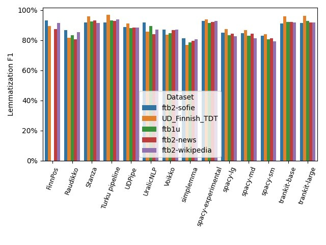
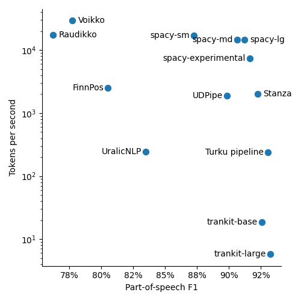
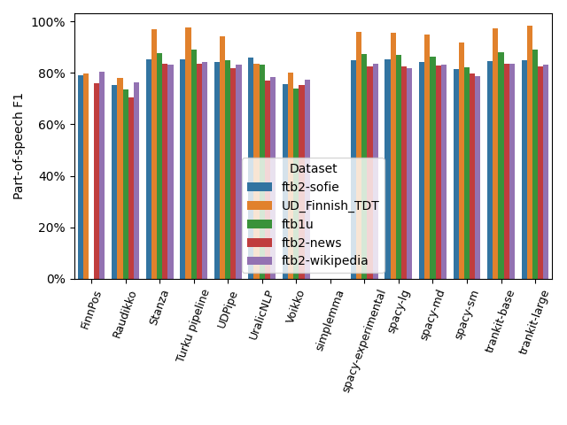

# Benchmarking Finnish POS taggers and lemmatizers

This repository contains an evaluation of the accuracy of open
source Finnish part-of-speech taggers and lemmatization algorihtms.

### Tested algorithms

* [spaCy](https://spacy.io/) 3.3.0
* [Experimental Finnish model for spaCy](https://github.com/aajanki/spacy-fi) 0.10.0
* [FinnPos](https://github.com/mpsilfve/FinnPos/wiki) git commit 81c1f735 (Oct 2019)
* [Simplemma](https://github.com/adbar/simplemma/) 0.6.0
* [Stanza](https://stanfordnlp.github.io/stanza/) 1.4.0
* [Trankit](https://trankit.readthedocs.io/en/latest/) 1.1.1
* [Turku neural parser pipeline](https://turkunlp.org/Turku-neural-parser-pipeline/) git commit 8c9425dd (Jan 2022)
* [UDPipe](http://ufal.mff.cuni.cz/udpipe) (through spacy-udpipe 1.0.0)
* [UralicNLP](https://github.com/mikahama/uralicNLP) 1.3.0
* [libvoikko](https://voikko.puimula.org/) 4.3.1 and Python voikko module 0.5

### Test datasets

* [FinnTreeBank 1](https://github.com/UniversalDependencies/UD_Finnish-FTB/blob/master/README.md) v1: randomly sampled subset of about 1000 sentences
* [FinnTreeBank 2](http://urn.fi/urn:nbn:fi:lb-201407163): news, Sofie and Wikipedia subsets
* [UD_Finnish-TDT](https://github.com/UniversalDependencies/UD_Finnish-TDT) r2.9: the testset

## Setup

Install dependencies:
* Python 3.9
* libvoikko with Finnish morphology data files
* clang (or other C++ compiler)
* Dependencies needed to compile [FinnPos](https://github.com/mpsilfve/FinnPos) and [cg3](https://github.com/GrammarSoft/cg3)

Setup git submodules, create a Python 3.9 (must be 3.9 because the Turku parser is incompatible with more recent Python versions) virtual environment and download test data and models by running the following commands:
```
git submodule init
git submodule update

python3.9 -m venv venv
source venv/bin/activate
pip install wheel
pip install -r requirements.txt

# Compile FinnPos
(cd models/FinnPos/src && make -j 4)

# Compile cg3 in models/cg3
# See https://visl.sdu.dk/cg3/chunked/installation.html

./download_data.sh
./download_models.sh
```

## Run

```
./run.sh
```

The numerical results will be saved in results/evaluation.csv, POS and
lemma errors made by each model will be saved in results/errorcases,
and plots will be saved in results/images.

## Results

### Lemmatization


Execution duration as a function of the F1 score on the concatenated data. Larger values are better on both axes. Notice that the Y-axis is
on log scale.

The execution duration is measured as a batched evaluation (a batch
contains all sentences from one dataset) on a 4 core CPU. Some methods
can be run on a GPU which most likely would improve
their performance, but I haven't tested that.



Lemmatization F1 scores for the benchmarked algorithms
on the test datasets.

### Part-of-speech tagging



Execution duration as a function of the POS F1 score on the concatenated data.

Note that FinnPos and Voikko do not make a distinction between
auxiliary and main verbs and therefore their performance suffers by
4-5% in this evaluation as they mislabel all AUX tags as VERBs.



Part-of-speech F1 scores for the benchmarked algorithms.

Simplemma does not include a POS tagging feature.
